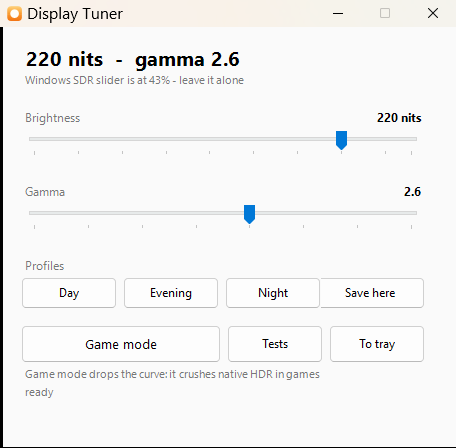
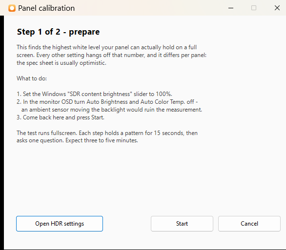

# win11-hdr-gamma-tuner

Brightness and gamma control for Windows 11 HDR mode — where Windows gives you
almost nothing.

[Русская версия](README.ru.md)



Built for a Dell UltraSharp U4025QW, but it works on any panel: the numbers that
matter are measured with the bundled test pages.

---

## Why

In HDR mode Windows 11 composites SDR content through the piecewise sRGB curve
instead of a power gamma 2.2. Shadows come out washed out and dark UI looks flat.
The fix is a correction curve loaded into the GPU gamma ramp.

That fix brings three annoyances, which this project removes:

- **Brightness in HDR is only adjustable through the Windows SDR slider**, which
  has no programmatic API. The monitor's own brightness menu is locked in HDR.
- **Moving that slider wipes the gamma ramp.** Your curve silently falls off and
  there is almost no way to notice by eye.
- **The curve also crushes native HDR in games**, so it has to be removed before
  launching one.

Display Tuner freezes the slider at a single value and moves brightness control
into the curve itself. From there it is an ordinary app: sliders, profiles,
a tray icon, autostart.

---

## How it works

The curve is computed in the PQ domain. In HDR mode the GPU gamma ramp operates
on final-signal codes, and in PQ a code means an absolute luminance in nits.

The generator takes **two** white levels:

| parameter | meaning | where it lives |
|---|---|---|
| `SliderNits` | where Windows puts SDR white | the Windows slider, set once |
| `WhiteNits` | the brightness you actually see | the curve, changed in software |

When they are equal you get classic gamma correction. When `WhiteNits` is lower,
brightness drops without Windows being involved at all.

The cost is code-space compression: at 140 nits out of 252 about 90% of the codes
remain. `band-test.html` checks this — no visible difference in banding.

Above `SliderNits` sits the HDR highlight range. There the curve is not identity
but a linear ramp in PQ coordinates from the new white up to peak; otherwise
there would be a discontinuity right at SDR white.

---

## Install

**1. Get ArgyllCMS** from [argyllcms.com](https://www.argyllcms.com/downloadwin.html)
and drop `dispwin.exe` next to the scripts.

It is deliberately not in this repository: ArgyllCMS ships under AGPL3/GPL2+,
and bundling someone else's binary under someone else's terms is a bad trade.

**2. Enable DDC/CI on the monitor:** `Menu → Others → DDC/CI → On`.
Needed to read and change monitor settings from scripts.

**3. Build the app:**

```powershell
.\Build-Exe.ps1
```

Draws the icon and compiles `DisplayTuner.exe` with the compiler shipped in
.NET Framework. Nothing to install.

**4. Deploy:**

```powershell
.\Setup.bat
```

Detects the monitor and GPU, generates the curve, walks you through the manual
steps and verifies the curve actually landed in the ramp.

**5. Autostart:** tick *Start with Windows* in the app.

That drops a shortcut into the Startup folder — no administrator rights, no
scheduled task, and you can see and remove it where you would expect. In
background mode the app waits 15 seconds before applying the curve, because
the display is not fully initialised right after logon and the ramp would be
wiped.

---

## The app

`DisplayTuner.exe`

- brightness slider, 80–252 nits;
- gamma slider, 1.8–3.2;
- Day / Evening / Night profiles, overwritable;
- **game mode** — drops the curve so native HDR is not crushed; the tray icon
  turns grey so the state is readable without opening anything;
- tray icon; the window minimises there;
- settings persist in `tuner-settings.json`.

Only one instance runs at a time. With autostart on, the app is already
sitting in the tray when you log in, so launching it again just brings that
window up instead of starting a second copy. You can also double-click the
tray icon or use *Show window* in its menu.

Switches: `-Tray` starts in the background with a tray icon (this is what
autostart uses), `-Apply` applies the saved settings and exits,
`-Lang en|ru` forces a language.

The interface follows the system locale — English everywhere except Russian
systems. There is a language selector in the bottom right of the window
(Auto / English / Русский); it switches live, no restart. The `-Lang` switch
and the `Lang` field in `tuner-settings.json` do the same.

---

## Test pages

All of them draw pixel by pixel on a canvas: the browser's dithering on CSS
gradients smears exactly what you need to see.

| file | what it checks |
|---|---|
| `gray-test.html` | shadow discrimination, step evenness, gamma |
| `band-test.html` | banding: narrow code ranges stretched across the screen |
| `color-test.html` | whether colour is clipping at the gamut boundary |
| `clip-test.html` | the panel's white ceiling |

`clip-test.html` is built to defeat local dimming, which many monitors do not let
you turn off. Instead of a patch on a background it draws alternating stripes of
two close codes across the whole screen. Every backlight zone then contains both
codes in equal measure, and dimming drops out of the equation.

---

## Calibrating your own panel

The white ceiling differs per panel, and everything else hangs off it. The
spec sheet is usually optimistic: the panel this was built on holds 255 nits
full-field where DisplayHDR 600 promises 350.

Run the wizard: **Tests → Calibrate panel…** in the app, or `Calibrate.ps1`
directly.



It asks you to park the Windows slider at 100% once, then does the rest
itself: the curve can map SDR white to any level *below* the slider, so the
wizard sweeps that level in software and shows a stripe pattern. You only
answer whether the stripes are visible. Binary search narrows the ceiling to
5 nits in three to five minutes, and the result is written to
`tuner-settings.json`.

The pattern is stripes of two close codes across the whole screen rather than
a patch on a background — that way every backlight zone holds both codes
equally and local dimming, which many monitors will not let you disable,
drops out of the measurement.

If you would rather do it by hand, `clip-test.html` is the same test driven
manually; feed the result in with `Setup.bat -SliderNits <nits>`,
where nits = 80 + 4 × slider percent.

---

## Other tools

| file | purpose |
|---|---|
| `LutGen.ps1` | curve generator, dot-sourced by everything else |
| `Monitor-VCP.ps1` | monitor settings over DDC/CI through the stock Windows API |
| `Sensor-Probe.ps1` | VCP code snapshots and diffs, for reverse-engineering vendor codes |
| `New-Icon.ps1` | draws the app icon |
| `Set-DisplayMode.ps1` | hdr / sdr / sdr-night / off profiles |

No third-party DDC/CI utility is needed — everything goes through `dxva2.dll`.

---

## Findings

Things that were tested and turned out to be dead ends, so you don't repeat them:

- **Saturation in HDR cannot be raised by anything except the GPU driver.**
  Hue/Saturation in the monitor OSD are locked in HDR, VCP codes `8A` and `90`
  are not exposed over DDC/CI, and Windows HDR Calibration does nothing visible.
  What remains is NVIDIA Digital Vibrance and its AMD/Intel equivalents.
- **Gamma is not saturation.** A per-channel power spreads the channels
  *downward*: colour gets more vivid, but the picture darkens and shadows close up.
- **A 1D curve cannot replace a saturation matrix.** In `.cal` and vcgt the red
  output depends only on the red input, so no such file can exist.
- **The monitor's ambient light sensor is not exposed.** Neither as a system
  sensor nor over DDC/CI — verified by snapshotting every VCP code under
  different lighting.

The full write-up, including measurements, is in [CLAUDE.md](CLAUDE.md) (Russian).

---

## License

MIT — see [LICENSE](LICENSE).

`dispwin.exe` from ArgyllCMS is not part of this repository and is distributed
under AGPL3/GPL2+ on its own terms.

---

## Requirements

- Windows 11 with HDR enabled
- PowerShell 5.1 (stock) and .NET Framework 4
- `dispwin.exe` from ArgyllCMS
- DDC/CI on the monitor — for reading its settings (not required for the curves)
