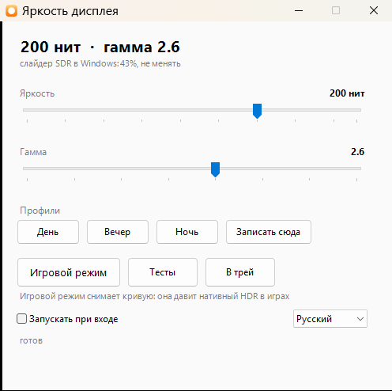

# win11-hdr-gamma-tuner

Управление яркостью и гаммой монитора в HDR-режиме Windows 11 — там, где штатных
средств для этого нет.

[English version](README.md)



Сделано под Dell UltraSharp U4025QW, но работает на любом мониторе: параметры
меряются заново тестами из комплекта.

---

## Зачем

Windows 11 в HDR-режиме композитит SDR-контент через кусочно-линейную кривую sRGB,
а не через степенную гамму 2.2. Тени получаются выцветшими, тёмный интерфейс —
плоским. Лечится загрузкой корректирующей кривой в гамма-рамп видеокарты.

Дальше начинаются неудобства, которые этот проект и убирает:

- **Яркость в HDR регулируется только слайдером Windows**, у которого нет
  программного интерфейса. Меню монитора в HDR заблокировано.
- **Слайдер очищает гамма-рамп.** Подвинул яркость — кривая молча слетела,
  и заметить это на глаз почти невозможно.
- **Кривая давит нативный HDR в играх**, её надо снимать перед запуском.

Display Tuner замораживает слайдер на одном значении и переносит управление
яркостью в саму кривую. Дальше это обычное приложение: ползунки, профили,
значок в трее, автозапуск.

---

## Как это работает

Кривая считается в PQ-домене: в HDR-режиме гамма-рамп видеокарты работает по
кодам финального сигнала, а в PQ код означает абсолютную яркость в нитах.

Генератор принимает **два** уровня белого:

| параметр | что это | где живёт |
|---|---|---|
| `SliderNits` | куда Windows кладёт белый SDR-контента | слайдер Windows, ставится один раз |
| `WhiteNits` | фактическая яркость, которую видит глаз | кривая, меняется программно |

Когда они равны — это классическая коррекция гаммы. Когда `WhiteNits` меньше —
яркость понижается без участия Windows.

Цена — сжатие кодового пространства: при белом 140 из 252 остаётся около 90%
кодов. Проверяется тестом `band-test.html`; на глаз разницы в полосении нет.

Выше `SliderNits` лежат света HDR-контента. Там кривая не единичная, а линейно
поднимается в PQ-координатах от нового белого до пика — иначе на границе
SDR-белого был бы разрыв.

---

## Установка

**1. Скачать ArgyllCMS** с [argyllcms.com](https://www.argyllcms.com/downloadwin.html)
и положить `dispwin.exe` из архива рядом со скриптами.

В репозитории его нет намеренно: ArgyllCMS распространяется под AGPL3/GPL2+,
и класть чужой бинарник в чужую лицензию не стоит.

**2. Включить DDC/CI в мониторе:** `Menu → Others → DDC/CI → On`.
Нужно, чтобы читать и править настройки монитора из скриптов.

**3. Собрать приложение:**

```powershell
.\Build-Exe.ps1
```

Рисует значок и компилирует `DisplayTuner.exe` компилятором из состава
.NET Framework. Ставить ничего не надо.

**4. Развернуть:**

```powershell
.\Setup.bat
```

Определит монитор и видеокарту, сгенерирует кривую, проведёт по ручным шагам
и проверит, что кривая действительно легла в рамп.

**5. Автозапуск:** поставьте галку «Запускать при входе» в приложении.

Она кладёт ярлык в папку автозагрузки — без прав администратора, без задачи
в планировщике, и убирается там же, где вы привыкли смотреть. В фоновом режиме
приложение ждёт 15 секунд перед применением кривой: сразу после входа дисплей
ещё не инициализирован, и гамма-рамп затёрся бы.

---

## Приложение

`DisplayTuner.exe`

- ползунок яркости 80–252 нит;
- ползунок гаммы 1.8–3.2;
- профили День / Вечер / Ночь с перезаписью;
- **игровой режим** — снимает кривую, чтобы не давить нативный HDR;
  значок в трее при этом сереет, состояние видно не открывая окна;
- значок в трее, окно сворачивается туда;
- **самовосстановление**: гамма-рамп чистится при пробуждении из сна, смене
  разрешения и переключении HDR, а пропажу коррекции на глаз почти не заметить.
  Приложение раз в 10 секунд проверяет рамп и возвращает кривую, если он стал
  линейным;
- настройки помнятся в `tuner-settings.json`.

Одновременно работает только один экземпляр. При включённом автозапуске
приложение уже сидит в трее, поэтому повторный запуск не поднимает копию,
а показывает то же окно. То же делают двойной клик по значку в трее и пункт
«Показать окно» в его меню.

Ключи: `-Tray` — фоновый запуск со значком в трее (его использует автозапуск),
`-Apply` — применить сохранённое и выйти, `-Lang en|ru` — задать язык.

Интерфейс следует системной локали: у вас русский, у остальных английский.
Переключатель языка — справа внизу окна (Auto / English / Русский),
меняет на лету без перезапуска. Ключ `-Lang` и поле `Lang`
в `tuner-settings.json` делают то же самое.

---

## Тесты

Все на canvas с попиксельной отрисовкой: браузерный дизер на градиентах
замазывает ровно то, что нужно увидеть.

| файл | что проверяет |
|---|---|
| `gray-test.html` | различимость теней, равномерность шагов, гамма |
| `band-test.html` | полосение: узкие диапазоны кодов во всю ширину экрана |
| `color-test.html` | не упирается ли цвет в границу гамута |
| `clip-test.html` | потолок белого панели |

`clip-test.html` устроен так, чтобы обойти локальное затемнение, которое на
многих мониторах не отключается: вместо пятна на фоне рисуются чередующиеся
полосы двух близких кодов по всему экрану. Внутри каждой зоны подсветки оба
кода лежат поровну, и затемнение выпадает из уравнения.

---

## Настройка под свой монитор

Потолок белого у каждой панели свой, и на нём держится всё остальное.
В характеристиках обычно написано больше, чем есть: панель, под которую всё
делалось, держит 255 нит на полном поле при обещанных DisplayHDR 600 трёхстах
пятидесяти.

Запустите мастер: **Тесты → Калибровать панель…** в приложении или
`Calibrate.ps1` напрямую.


Он просит один раз поставить слайдер Windows на 100%, а дальше делает всё сам:
кривая умеет отображать SDR-белый на любой уровень **ниже** слайдера, поэтому
мастер перебирает этот уровень программно и показывает узор. От вас — только
ответ, видны полосы или нет. Половинным делением потолок находится с точностью
до 5 нит за три-пять минут, результат пишется в `tuner-settings.json`.

Узор — полосы двух близких кодов по всему экрану, а не пятно на фоне: так
внутри каждой зоны подсветки оба кода лежат поровну, и локальное затемнение,
которое на многих мониторах не отключается, выпадает из замера.

Руками то же самое делается через `clip-test.html`, а результат задаётся
как `Setup.bat -SliderNits <нит>`, где нит = 80 + 4 × процент слайдера.

---

## Прочие инструменты

| файл | назначение |
|---|---|
| `LutGen.ps1` | генератор кривых, подключается через точку |
| `Monitor-VCP.ps1` | настройки монитора по DDC/CI через штатный Windows API |
| `Sensor-Probe.ps1` | снимки VCP-кодов и сравнение — для разбора вендорских кодов |
| `New-Icon.ps1` | рисует значок приложения |
| `Set-DisplayMode.ps1` | профили hdr / sdr / sdr-night / off |

Сторонних программ для работы с DDC/CI не нужно: всё через `dxva2.dll`.

---

## Известное

- **Насыщенность в HDR не поднимается ничем, кроме драйвера видеокарты.**
  Ручки Hue/Saturation в меню монитора в HDR заблокированы, по DDC/CI коды
  `8A` и `90` не отдаются, Windows HDR Calibration эффекта не даёт.
  Остаётся Digital Vibrance у NVIDIA и его аналоги у AMD и Intel.
- **Гамма — это не насыщенность.** Поканальная степень разводит каналы вниз:
  цвет сочнее, но картинка темнее и тени закрываются.
- **Одномерная кривая матрицу насыщенности не заменит.** В `.cal` и vcgt
  красный на выходе зависит только от красного на входе.
- **Датчик освещённости монитора наружу не выведен.** Ни как системный сенсор,
  ни через DDC/CI — проверено снимками всех кодов при разном освещении.

Подробный разбор, включая измерения и тупиковые ветки, — в [CLAUDE.md](CLAUDE.md).

---

## Лицензия

MIT — см. [LICENSE](LICENSE).

`dispwin.exe` из ArgyllCMS в репозиторий не входит и распространяется под
AGPL3/GPL2+ на своих условиях.

---

## Требования

- Windows 11 с включённым HDR
- PowerShell 5.1 (штатный) и .NET Framework 4
- `dispwin.exe` из ArgyllCMS
- DDC/CI в мониторе — для чтения его настроек (не обязательно для кривых)
